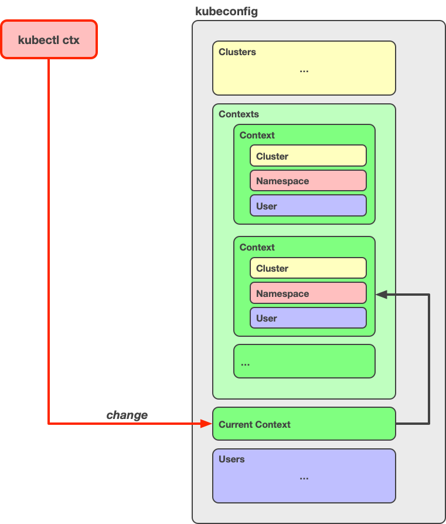

# kubectl ctx

A kubectl [plugin](https://kubernetes.io/docs/tasks/extend-kubectl/kubectl-plugins/) for interactively changing your *kubeconfig* context.

This makes it easier to work with multiple clusters from the same machine.

## Installation

To install the plugin, simply download the `kubectl-ctx` file and save it in any directory that is in your `PATH`.

You can verify that the plugin is correctly installed by running the following command:

~~~bash
kubectl plugin list
~~~~

This lists all the plugins that `kubectl` detected, and the `kubectl-ctx` plugin should be listed there too.

To uninstall the plugin, simply delete the `kubectl-ctx` file.

## Usage

Change the current context:

~~~bash
kubectl ctx
~~~

List all contexts:

~~~bash
kubectl ctx -l
~~~

## How It Works

When you run `kubectl ctx`, the plugin changes the `current-context` element of your [*kubeconfig*](https://kubernetes.io/docs/concepts/configuration/organize-cluster-access-kubeconfig/) configuration:

Note that this includes a physical change to one of your *kubeconfig* files (the default *kubeconfig* file is `~/.kube/config`, but you can have multiple *kubeconfig* files by by listing them in the [`KUBECONFIG`](https://kubernetes.io/docs/concepts/configuration/organize-cluster-access-kubeconfig/#the-kubeconfig-environment-variable) environment variable).

When you run `kubectl ctx -l`, the plugin displays the names of all the contexts in your *kubeconfig* configuration.

## Dependencies

The plugin depends on the [fzf](https://github.com/junegunn/fzf) command being available on your system.

You can install fzf as follows:

- Homebrew (macOS) and Linuxbrew (Linux):
    ~~~bash
    brew install fzf
    ~~~
- From source (macOS and Linux):
    ~~~bash
    git clone https://github.com/junegunn/fzf.git ~/.fzf
    ~/.fzf/install
    ~~~
- For further installation options, see [here](https://github.com/junegunn/fzf#installation)
